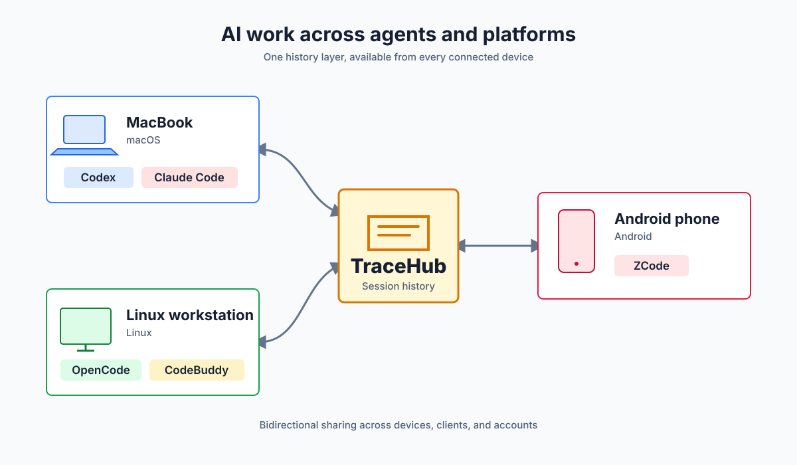

# TraceHub

[English](README.md) | [简体中文](README.zh-CN.md)

**让 AI 工作跨越 Agent 与平台。**

当前版本：`v0.1.0-alpha.5`。

TraceHub 是一个单用户、多设备的私有 AI Agent 会话中心。第一版读取 Codex 本地 JSONL，会话原文经 gzip 和 age 加密后增量上传，服务端使用 SQLite 保存不可变密文和可搜索的派生索引，再通过本地 stdio MCP 供 Codex 查询。

## 在新设备上衔接工作

在 MacBook 上完成编码和部署工作后，你可以在新的 Linux 设备上安装 Codex CLI，
连接 TraceHub，并快速找回相关任务历史和工作上下文。



> 产品愿景：不同 Agent 产品通过 TraceHub 共享历史。当前 alpha 版本仅支持 Codex
> 会话。

## 数据流

```text
~/.codex/sessions（启用后再包含 archived_sessions）
  -> tracehub sync
  -> 完整 JSONL 行 / gzip / age X25519
  -> HTTPS / Ed25519 请求签名
  -> tracehub serve / SQLite
  -> tracehub mcp / Codex
```

TraceHub 不运行后台同步。`chunks` 中的原始密文是事实来源；消息索引不包含 reasoning，工具输出只保存定位信息并在请求时临时解密。

## 构建

需要 Go 1.26：

```bash
make test
make build
make dist
```

`make dist` 生成 macOS/Linux 的 amd64 和 arm64 二进制。

## 生成密钥

服务端生成 age X25519 密钥：

```bash
tracehub keygen server \
  --private /etc/tracehub/keys/server.key \
  --public ./server.pub
```

systemd 部署时，服务私钥必须由服务用户读取：

```bash
chown tracehub:tracehub /etc/tracehub/keys/server.key
chmod 600 /etc/tracehub/keys/server.key
```

每个客户端生成独立 Ed25519 密钥：

```bash
tracehub keygen device \
  --private ./device.key \
  --public ./desktop.pub
```

私钥以 `0600` 创建，已存在的目标不会被覆盖。将服务端公钥显式放到每台客户端；将客户端公钥显式写入服务端配置，不提供在线登记接口。

## 配置

配置使用严格 JSON，未知字段会直接报错。参考：

- `config/server.example.json`
- `config/client.example.json`

服务端配置中的 `server_private_keys` 是可解密历史归档的 keyring。客户端只使用 `server_key_id` 指定的公钥加密新分块。

客户端的 `codex_dir` 指向 Codex 根目录，默认示例为 `~/.codex`。
`include_archived_sessions` 默认是 `false`，因此 TraceHub 只扫描 `sessions`；
设为 `true` 时才额外扫描 `archived_sessions`。发现过程会拒绝符号链接、配置来源内
的重复会话、文件 UUID 不匹配及被截断的会话。

## 运行服务

直接运行：

```bash
tracehub serve --config /etc/tracehub/server.json
```

服务默认监听 `127.0.0.1:8080`。现有 Nginx、Caddy 或内网网关负责 HTTPS；反向代理需要允许至少 66 MiB 请求体，并且不得记录请求或响应正文。`GET /healthz` 是唯一无需设备签名的端点，只返回服务存活状态。

systemd 单元位于 `deploy/systemd/tracehub.service`。

### 单 Docker 部署

拉取已发布的 Linux amd64/arm64 镜像：

```bash
docker pull ghcr.io/streamsc/tracehub:v0.1.0-alpha.5
```

也可以从仓库根目录构建镜像：

```bash
docker build \
  -f deploy/docker/Dockerfile \
  -t tracehub:0.1.0-alpha.5 \
  .
```

准备容器专用配置和密钥。该配置监听 `0.0.0.0:8080`，与宿主机直接运行时的回环监听不同：

```bash
cd deploy/docker
cp server.example.json server.json
mkdir keys
# 将 server.key 和设备公钥放入 keys 后：
sudo chown -R 10001:10001 keys
chmod 600 keys/server.key
docker volume create tracehub-data
```

启动单个容器：

```bash
docker run -d \
  --name tracehub \
  --restart no \
  -p 127.0.0.1:8080:8080 \
  -v "$PWD/server.json:/etc/tracehub/server.json:ro" \
  -v "$PWD/keys:/etc/tracehub/keys:ro" \
  -v tracehub-data:/var/lib/tracehub \
  --health-cmd 'wget -q -O - http://127.0.0.1:8080/healthz' \
  --health-interval 30s \
  --health-timeout 5s \
  --health-retries 3 \
  ghcr.io/streamsc/tracehub:v0.1.0-alpha.5
```

### Docker Compose 部署

```bash
cd deploy/docker
cp server.example.json server.json
mkdir keys
# 将 server.key 和设备公钥放入 keys 后：
sudo chown -R 10001:10001 keys
chmod 600 keys/server.key
docker compose up --build
```

容器内 `tracehub` 用户固定为 UID/GID `10001`；设备公钥可使用 `0644`，服务私钥必须保持 `0600`。

单 Docker 和 Docker Compose 都运行相同的 `tracehub serve`，使用相同配置和 `/var/lib/tracehub/tracehub.db` 数据路径。

## 同步

```bash
tracehub sync --config ./client.json
```

客户端先向服务端查询每个会话的权威字节偏移，只上传之后新增且以换行结束的完整 JSONL。正常分块目标约 4 MiB；大记录独占分块；单条记录超过 64 MiB 时明确失败。重复执行不会重复保存已有分块。

管理员删除云端会话后，若源设备仍保留该 JSONL，下一次同步会重新上传；需要永久排除时，应同时移走源文件。

## 配置 Codex MCP

在 Codex 配置中添加本地 stdio server：

```toml
[mcp_servers.tracehub]
command = "/usr/local/bin/tracehub"
args = ["mcp", "--config", "/Users/you/.config/tracehub/client.json"]
```

提供五个工具：`list_devices`、`search_sessions`、`get_session_info`、`read_session`、`read_tool_output`。所有历史内容均标记为不可信数据；`read_session` 单页最多 50 个事件或 256 KiB；`read_tool_output` 单次最多 256 KiB；reasoning 永不通过 MCP 返回。

## 管理

原子导出完整原始 JSONL：

```bash
tracehub admin export-session \
  --config /etc/tracehub/server.json \
  --device desktop \
  --session 019ffdf2-452e-7c60-bd5d-4d88b56ef31b \
  --output ./session.jsonl
```

显式删除归档和索引：

```bash
tracehub admin delete-session \
  --config /etc/tracehub/server.json \
  --device desktop \
  --session 019ffdf2-452e-7c60-bd5d-4d88b56ef31b
```

删除命令同时清理 FTS 记录并截断 SQLite WAL。数据默认永久保留，不提供 MCP 或 HTTP 远程删除接口。

## 安全边界

- 服务端和 TLS 反向代理是可信端，能够解密完整会话。
- 原始会话在 SQLite 中保持 age 密文；搜索索引、工作目录和对话文本是明文，应使用受限目录权限和磁盘加密。
- 请求签名不替代 HTTPS。第一版不维护 nonce 或短期会话；写操作以服务端偏移量保证幂等，查询操作只读。
- Codex JSONL 不是 TraceHub 的公共协议，所有格式解析都限制在 `internal/codex` 适配器内。

## 项目治理

- [贡献指南](CONTRIBUTING.zh-CN.md)
- [需求管理](docs/requirements/README.zh-CN.md)
- [发布管理](docs/releasing.zh-CN.md)
- [变更日志](CHANGELOG.md)

本项目采用 [Apache License 2.0](LICENSE) 许可证。
